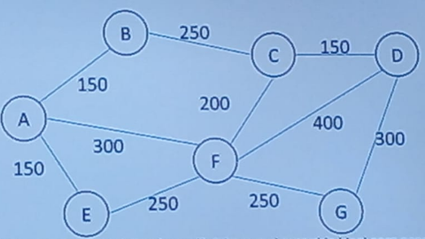

# Problema 8
Una empresa agropecuaria tiene su propiedad dividida en 7 potreros para el engorde de bovinos, el mapa de estos potreros es el siguiente, las distancias están en metros:

Mediante un programa determine cuál debe ser el recorrido ideal para asegurarse de llevar suplementos alimenticios a cada uno de los potreros, la longitud del recorrido en metros y calcular la cantidad total y cuánto se debe dejar del suplemento a cada potrero, si la cantidad a suministrar se calcula dando 120gr por cada animal.

menú con 3 opciones: 
1. arbol recubridor mínimo. 
2. Cálculo total suministro de todo el suministro.
3. Calcular suministro por potrero.
4. Salir.

# Problema 10

Se recibe un archivo de texto en el que se encuentran las solicitudes de manejo de 5 documentos, en donde se define el destino final de los mismos, identificación y el nombre del solicitante. El vértice A es la oficina que recibe los documentos. Determinar la duración en días de trámite para cada documento generando un ticket para cada usuario (archivo de texto cuyo nombre es la letra A seguida de la identificación del usuario) informando lo anterior. Calcular el total de días requeridos para todos los documentos y generar una estadística de las oficinas con documentos requeridos y el número de solicitudes por usuario. Todo lo anterior se debe manejar desde un menú de opciones.

Opciones :
1. Agregar archivo
2. Calcular total de dias requeridos para todos los documentos
3. Estadística de las oficinas
4. Estadística por número de solicitudes de usuario
5. Salir

en el archivo de texto vienen 5 solicitudes
en lugar de write usar append